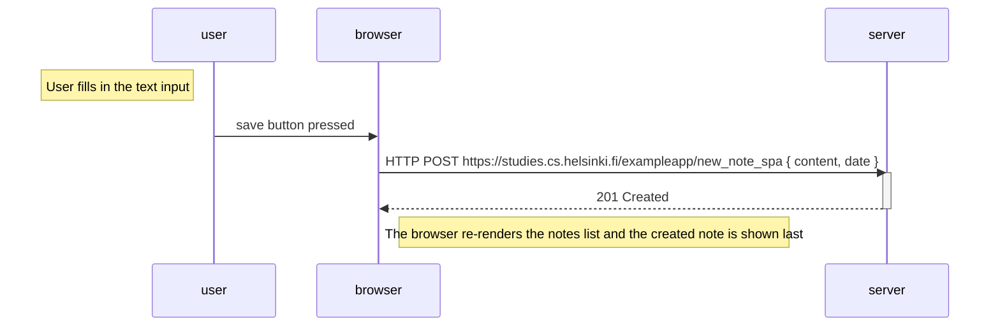

```mermaid
sequenceDiagram
    participant user
    participant browser
    participant server

    Note left of user: User fills in the text input
    user->>browser: save button pressed

    browser->>server: HTTP POST https://studies.cs.helsinki.fi/exampleapp/new_note_spa { content, date }

    activate server
    server-->>browser: 201 Created
    deactivate server

    Note right of browser: The browser re-renders the notes list and the created note is shown last

```